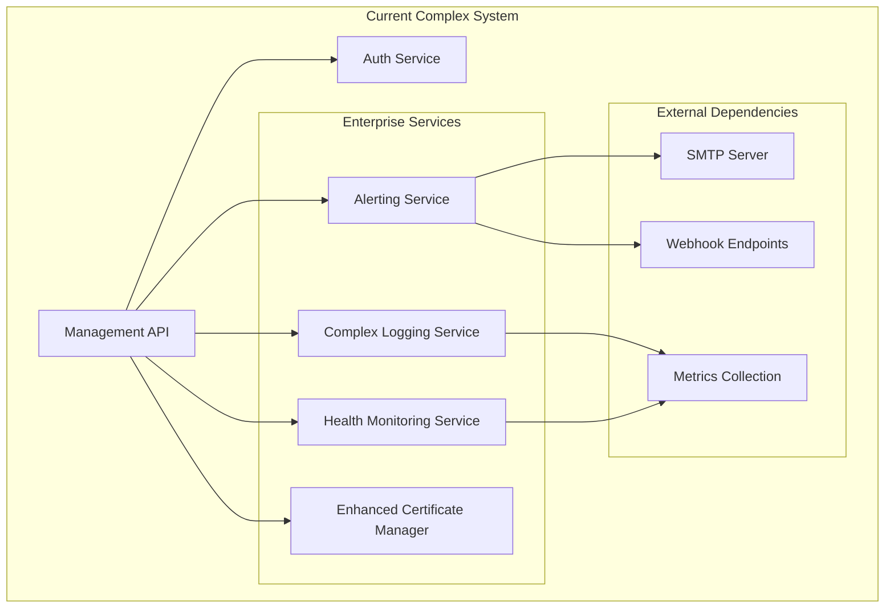
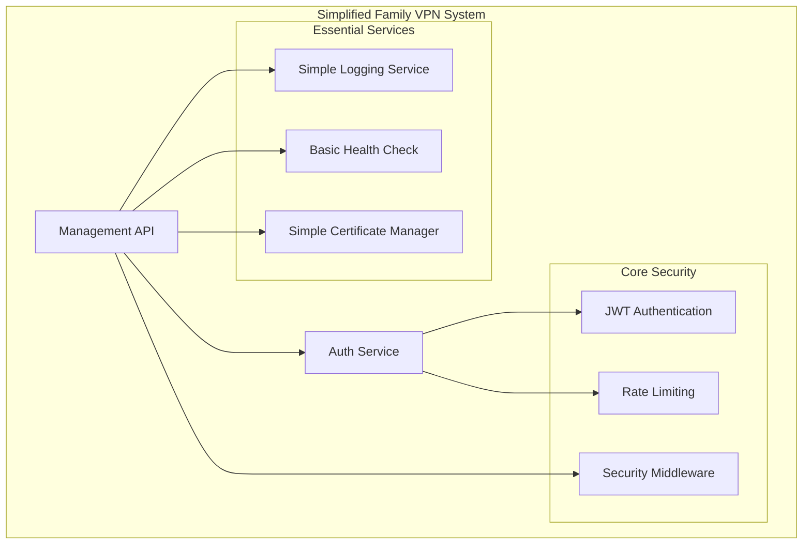

# Design Document

## Overview

This design outlines the simplification of an over-engineered family VPN server that currently includes enterprise-level complexity inappropriate for its intended use case. The system was previously hardened with comprehensive security features, but the implementation went beyond what's necessary for a family VPN, introducing maintenance overhead and complexity that doesn't provide proportional value.

The refactoring will remove enterprise-level features while maintaining essential security hardening, resulting in a system that is:
- Appropriate for family use cases
- Easier to maintain and debug
- Secure but not over-engineered
- Focused on core VPN functionality

## Architecture

### Current Architecture (Over-Engineered)



### Target Architecture (Simplified)



## Components and Interfaces

### 1. Simplified Logging Service

**Purpose**: Provide structured logging without enterprise complexity

**Changes from Current**:
- Remove correlation ID tracking throughout the codebase
- Remove tamper-evident logging with integrity hashing
- Merge security logger into main logger (single winston instance)
- Simplify log format while keeping daily rotation
- Remove complex structured logging formats

**Simplified Interface**:
```javascript
class SimplifiedLoggingService {
  // Simplified methods without correlation ID parameters
  info(message, meta = {})
  warn(message, meta = {})
  error(message, meta = {})
  debug(message, meta = {})
  
  // Basic security event logging (no complex tracking)
  logSecurityEvent(eventType, message, meta = {})
  logAuthenticationEvent(eventType, username, clientIP, success, meta = {})
  logCertificateEvent(eventType, clientName, username, clientIP, meta = {})
}
```

### 2. Basic Health Monitoring Service

**Purpose**: Simple health status without enterprise monitoring

**Changes from Current**:
- Remove complex system monitoring (CPU, memory, disk analysis)
- Remove OpenVPN process monitoring and periodic health checks
- Remove complex health check intervals and system analysis
- Keep basic `/health` endpoint with simple status
- Keep basic HTTP request counting (lightweight and useful)

**Simplified Interface**:
```javascript
class BasicHealthService {
  // Simple health status
  async getBasicHealthStatus()
  
  // Basic request tracking (keep this as it's useful)
  recordHttpRequest(method, route, statusCode)
  
  // Simple metrics summary
  getBasicMetrics()
}
```

### 3. Simplified Certificate Management

**Purpose**: Basic certificate operations without enterprise PKI features

**Changes from Current**:
- Remove automated certificate renewal features
- Remove complex certificate validation and integrity checking
- Remove certificate integrity hashing and audit trails
- Keep basic certificate generation with proper file permissions
- Keep CRL generation (simple and useful for families)

**Simplified Interface**:
```javascript
class SimplifiedCertificateManager {
  // Basic certificate operations
  async generateClientCertificate(clientName)
  async generateCRL()
  
  // Simple validation (no complex integrity checking)
  async validateCertificate(certificate)
}
```

### 4. Removed Components

**Alerting Service**: Completely removed
- No email/webhook alerting system
- No SMTP configuration requirements
- No complex alert thresholds and cooldowns
- No alert correlation and tracking

**Enterprise Monitoring**: Removed complex features
- No Prometheus metrics collection
- No system resource monitoring
- No OpenVPN process monitoring
- No complex health check orchestration

## Data Models

### Simplified Log Entry
```javascript
{
  timestamp: Date,
  level: string,
  message: string,
  // No correlation ID
  ...meta // Simple metadata without complex tracking
}
```

### Basic Health Status
```javascript
{
  status: 'healthy' | 'warning' | 'error',
  timestamp: Date,
  uptime: number,
  basicStats: {
    httpRequests: number,
    authAttempts: number,
    certificatesGenerated: number
  }
}
```

### Simple Security Event
```javascript
{
  timestamp: Date,
  eventType: string,
  message: string,
  username?: string,
  clientIP?: string,
  // No correlation ID or complex tracking
  ...basicMeta
}
```

## Error Handling

### Simplified Error Handling Strategy
- **Maintain Security**: Generic error messages for authentication failures
- **Simple Logging**: Errors logged with basic context, no correlation tracking
- **Rate Limiting**: Keep existing rate limiting (essential for security)
- **Graceful Degradation**: System continues with reduced functionality during failures

### Error Categories (Simplified)
1. **Authentication Errors**: Invalid credentials, account lockouts
2. **Certificate Errors**: Generation failures, invalid certificates
3. **System Errors**: File system errors, configuration issues
4. **Network Errors**: Connection failures, timeout errors

## Testing Strategy

### Simplified Testing Approach
1. **Essential Functionality Tests**: Authentication, certificate generation, VPN connectivity
2. **Security Tests**: Rate limiting, authentication security, certificate security
3. **Integration Tests**: End-to-end certificate lifecycle
4. **Docker Tests**: Container build and deployment

### Test Coverage Focus
- 100% coverage for authentication and authorization logic
- Essential certificate operations testing
- Basic security middleware testing
- Docker deployment validation

## Implementation Plan

### Phase 1: Remove Alerting System
- Delete `AlertingService` class and all references
- Remove nodemailer dependency
- Remove alerting method calls from all services
- Remove `/api/test-alert` endpoint
- Clean up SMTP environment variables

### Phase 2: Simplify Logging Service
- Remove correlation ID parameters from all logging methods
- Remove `generateIntegrityHash()` and tamper-evident features
- Merge security logger into main logger
- Update all logging calls throughout codebase
- Simplify log format while keeping daily rotation

### Phase 3: Simplify Health Monitoring
- Remove complex system monitoring methods
- Remove OpenVPN process monitoring
- Remove periodic health check intervals
- Keep basic `/health` endpoint with simple status
- Keep basic HTTP request counting

### Phase 4: Simplify Certificate Management
- Remove automated certificate renewal
- Remove complex certificate validation
- Remove certificate integrity hashing
- Keep basic generation with proper permissions
- Keep CRL generation (useful for families)

### Phase 5: Update Server Integration
- Remove alerting service initialization
- Simplify logging calls (remove correlation ID parameters)
- Remove complex health monitoring integration
- Keep essential security middleware
- Update error handling to use simplified logging

### Phase 6: Clean Up Dependencies
- Remove `nodemailer` from package.json
- Update npm scripts if needed
- Clean up environment variables
- Update documentation

## Security Preservation

### Maintained Security Features
- **Authentication**: JWT with bcrypt, rate limiting, secure cookies
- **Authorization**: Token-based access control
- **Certificate Security**: Proper file permissions, secure generation
- **OpenVPN Hardening**: All security configurations preserved
- **Docker Security**: Container hardening maintained
- **Network Security**: Rate limiting and security headers

### Removed Security Features (Deemed Excessive)
- Email alerting for security events
- Correlation ID tracking across requests
- Tamper-evident logging with integrity hashing
- Complex system resource monitoring
- Automated certificate renewal (manual is fine for families)
- Enterprise-level audit trails

## Benefits of Simplification

### Reduced Complexity
- ~500+ lines of enterprise code removed
- Fewer dependencies and potential vulnerabilities
- Simpler codebase easier to understand and maintain
- Reduced configuration requirements

### Maintained Functionality
- All essential VPN functionality preserved
- Security hardening maintained where appropriate
- Authentication and certificate generation work as before
- Docker deployment continues to work

### Family-Appropriate Scope
- No unnecessary enterprise features
- Simpler operation and maintenance
- Reduced resource usage
- Focus on core VPN functionality

This design ensures the family VPN server remains secure and functional while removing inappropriate enterprise complexity that adds maintenance burden without providing proportional value for the intended use case.