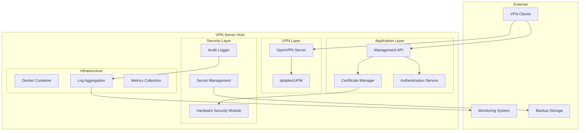

# Design Document

## Overview

This design transforms the existing OpenVPN server from a basic implementation with critical security vulnerabilities into a production-ready, hardened VPN solution. The architecture emphasizes security-first principles, automated operations, comprehensive monitoring, and compliance with industry standards.

The solution addresses the identified critical vulnerabilities:
- Hardcoded credentials (`username === 'root' && password === 'paparol@42'`)
- Exposed public IP address in configuration
- Weak authentication mechanisms
- Missing security hardening
- Inadequate logging and monitoring
- Lack of proper certificate lifecycle management

## Architecture

### High-Level Architecture



### Security Architecture

The security model implements defense-in-depth with multiple layers:

1. **Network Security**: Firewall rules, network segmentation, DDoS protection
2. **Application Security**: Input validation, secure coding practices, dependency scanning
3. **Authentication**: Multi-factor authentication, certificate-based client auth
4. **Authorization**: Role-based access control, principle of least privilege
5. **Encryption**: End-to-end encryption, secure key management
6. **Monitoring**: Real-time threat detection, audit logging, alerting

## Components and Interfaces

### 1. Authentication Service

**Purpose**: Replace hardcoded credentials with secure authentication mechanisms

**Key Features**:
- JWT-based authentication with refresh tokens
- Multi-factor authentication (TOTP/HOTP)
- Rate limiting and brute force protection
- Session management with secure cookies
- Integration with external identity providers (optional)

**Interface**:
```javascript
class AuthenticationService {
  async authenticate(credentials, mfaToken)
  async generateTokens(user)
  async validateToken(token)
  async refreshToken(refreshToken)
  async revokeToken(token)
}
```

### 2. Enhanced Certificate Manager

**Purpose**: Secure certificate lifecycle management with automated operations

**Key Features**:
- Automated certificate renewal (30 days before expiration)
- Certificate revocation list (CRL) management
- Hardware Security Module (HSM) integration for CA key protection
- Certificate transparency logging
- Backup and recovery of certificate infrastructure

**Interface**:
```javascript
class SecureCertificateManager {
  async generateClientCertificate(clientId, attributes)
  async revokeCertificate(serialNumber, reason)
  async renewCertificate(serialNumber)
  async validateCertificate(certificate)
  async generateCRL()
  async backupCertificates()
}
```

### 3. Security Configuration Manager

**Purpose**: Apply and maintain security hardening configurations

**Key Features**:
- OpenVPN security parameter enforcement
- Firewall rule management
- System hardening (disable unnecessary services)
- Security compliance checking
- Configuration drift detection

**Interface**:
```javascript
class SecurityConfigManager {
  async applyOpenVPNHardening()
  async configureFirewall()
  async hardenSystem()
  async validateCompliance()
  async detectConfigDrift()
}
```

### 4. Monitoring and Alerting System

**Purpose**: Comprehensive observability and security monitoring

**Key Features**:
- Structured logging with correlation IDs
- Real-time metrics collection (Prometheus format)
- Security event detection and alerting
- Performance monitoring and capacity planning
- Compliance reporting

**Interface**:
```javascript
class MonitoringSystem {
  async logSecurityEvent(event, context)
  async recordMetric(name, value, labels)
  async generateAlert(severity, message, context)
  async createComplianceReport(period)
}
```

### 5. Backup and Recovery Service

**Purpose**: Automated backup and disaster recovery capabilities

**Key Features**:
- Encrypted backup of certificates and configurations
- Point-in-time recovery capabilities
- Cross-region backup replication
- Automated backup verification
- Recovery testing automation

**Interface**:
```javascript
class BackupRecoveryService {
  async createBackup(type, encryption)
  async restoreFromBackup(backupId, targetPath)
  async verifyBackupIntegrity(backupId)
  async scheduleBackup(schedule, retention)
}
```

## Data Models

### User Authentication
```javascript
{
  userId: string,
  username: string,
  passwordHash: string, // bcrypt with salt rounds >= 12
  mfaSecret: string, // encrypted
  roles: string[],
  lastLogin: Date,
  failedAttempts: number,
  lockedUntil: Date,
  createdAt: Date,
  updatedAt: Date
}
```

### Certificate Record
```javascript
{
  serialNumber: string,
  commonName: string,
  subjectAlternativeNames: string[],
  issuer: string,
  validFrom: Date,
  validTo: Date,
  status: 'active' | 'revoked' | 'expired',
  revocationReason: string,
  certificateType: 'ca' | 'server' | 'client',
  keySize: number,
  algorithm: string,
  fingerprint: string,
  createdAt: Date,
  revokedAt: Date
}
```

### Security Event
```javascript
{
  eventId: string,
  timestamp: Date,
  eventType: string,
  severity: 'low' | 'medium' | 'high' | 'critical',
  source: string,
  userId: string,
  clientIP: string,
  userAgent: string,
  details: object,
  correlationId: string
}
```

## Error Handling

### Security-First Error Handling
- **Information Disclosure Prevention**: Generic error messages for authentication failures
- **Rate Limiting**: Exponential backoff for failed authentication attempts
- **Audit Trail**: All errors logged with context for security analysis
- **Graceful Degradation**: System continues operating with reduced functionality during partial failures

### Error Categories
1. **Authentication Errors**: Invalid credentials, MFA failures, account lockouts
2. **Authorization Errors**: Insufficient permissions, expired tokens
3. **Certificate Errors**: Invalid certificates, expired certificates, revoked certificates
4. **Network Errors**: Connection failures, timeout errors, DNS resolution failures
5. **System Errors**: File system errors, memory issues, configuration errors

## Testing Strategy

### Security Testing
1. **Penetration Testing**: Regular security assessments by third-party experts
2. **Vulnerability Scanning**: Automated scanning of dependencies and container images
3. **Static Code Analysis**: Security-focused code analysis (SonarQube, Semgrep)
4. **Dynamic Application Security Testing (DAST)**: Runtime security testing
5. **Compliance Testing**: Automated compliance validation against security frameworks

### Functional Testing
1. **Unit Tests**: Individual component testing with security focus
2. **Integration Tests**: End-to-end certificate lifecycle testing
3. **Load Testing**: Performance testing under high client loads
4. **Chaos Engineering**: Resilience testing with failure injection
5. **Backup/Recovery Testing**: Regular disaster recovery drills

### Test Coverage Requirements
- Minimum 90% code coverage for security-critical components
- 100% coverage for authentication and authorization logic
- Comprehensive test cases for all certificate operations
- Security test cases for all API endpoints

## Security Hardening Specifications

### OpenVPN Configuration Hardening
```
# Encryption and Authentication
cipher AES-256-GCM
auth SHA256
tls-crypt ta.key
tls-version-min 1.2

# Perfect Forward Secrecy
dh dh2048.pem
ecdh-curve prime256v1

# Security Options
remote-cert-tls client
verify-client-cert require
crl-verify crl.pem

# Network Security
topology subnet
push "redirect-gateway def1 bypass-dhcp"
push "dhcp-option DNS 1.1.1.1"
push "dhcp-option DNS 1.0.0.1"
push "block-outside-dns"

# Connection Security
keepalive 10 60
ping-timer-rem
persist-tun
persist-key

# Logging and Monitoring
verb 3
status /var/log/openvpn/status.log 10
log-append /var/log/openvpn/server.log
```

### Container Security Configuration
```dockerfile
# Multi-stage build for minimal attack surface
FROM node:18-alpine AS builder
# ... build stage

FROM alpine:3.18 AS runtime
RUN addgroup -g 1001 -S openvpn && \
    adduser -S -D -H -u 1001 -s /sbin/nologin openvpn
USER openvpn:openvpn

# Security labels and metadata
LABEL security.scan="enabled" \
      security.compliance="hardened"

# Health check
HEALTHCHECK --interval=30s --timeout=10s --start-period=5s --retries=3 \
  CMD curl -f http://localhost:3000/health || exit 1
```

### Firewall Rules
```bash
# Default policies
iptables -P INPUT DROP
iptables -P FORWARD DROP
iptables -P OUTPUT ACCEPT

# OpenVPN traffic
iptables -A INPUT -p udp --dport 1194 -j ACCEPT
iptables -A INPUT -i tun+ -j ACCEPT
iptables -A FORWARD -i tun+ -j ACCEPT
iptables -A FORWARD -o tun+ -j ACCEPT

# Management API (restricted)
iptables -A INPUT -p tcp --dport 3000 -s 10.0.0.0/8 -j ACCEPT

# Rate limiting for management API
iptables -A INPUT -p tcp --dport 3000 -m limit --limit 10/min -j ACCEPT
```

This design provides a comprehensive security transformation while maintaining operational efficiency and scalability.